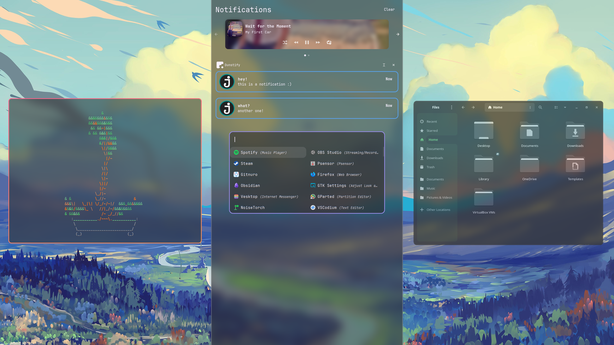
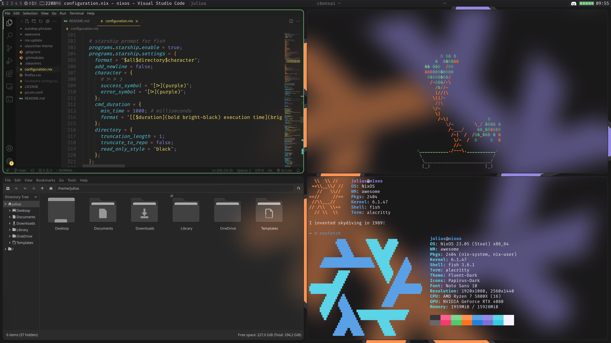
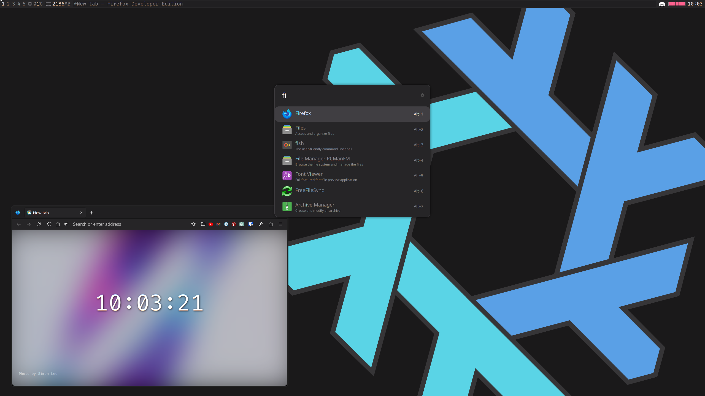

# [NixOS](https://nixos.org/) configuration and other dotfiles

### Credit
- My [Awesome](https://awesomewm.org/) config is based on the "rainbow" theme of [awesome-copycats](https://github.com/lcpz/awesome-copycats)
- My [Rofi](https://github.com/lbonn/rofi) themes are based on the "rounded" theme of [rofi-themes-collection](https://github.com/newmanls/rofi-themes-collection)
- The wallpapers in `wallpapers/nixos/` are modified versions of `nix-wallpaper-nineish-dark-gray` of [nixos-artwork](https://github.com/NixOS/nixos-artwork)

# Screenshots / Showcase
### [v2.0.0](https://github.com/julius-boettger/dotfiles/releases/tag/v2.0.0)
https://github.com/julius-boettger/dotfiles/assets/85450899/6cf57c22-b1bf-4ba0-9eb9-cc55d3327345
<p align="middle">
  
   
</p>
(also still contains the setup of v1.0.0, but with slight modifications)

### [v1.0.0](https://github.com/julius-boettger/dotfiles/releases/tag/v1.0.0)
https://github.com/julius-boettger/dotfiles/assets/85450899/4f33b2a8-80b3-47ff-8cc9-b1298d3d5de2
<p align="middle">
  
   
</p>

# About this repo
- This repo contains configuration files I daily drive on multiple machines, including Windows ones through [WSL](https://learn.microsoft.com/en-us/windows/wsl/). Its purpose is:
    - providing version control for my config files
    - serving as documentation and inspiration for customizing your system
- With this repo you get a [Flake](https://nixos.wiki/wiki/Flakes)-based [NixOS](https://nixos.org) configuration that includes...
  - two fully functional desktop sessions:
    - [Awesome](https://github.com/awesomeWM/awesome) + [Picom](https://github.com/jonaburg/picom) (on Xorg)
    - [Hyprland](https://hyprland.org/) (on Wayland)
    - => See [Installation (Desktop)](#installation-desktop)
  - a nice [WSL](https://learn.microsoft.com/en-us/windows/wsl/) setup
    - => See [Installation (WSL)](#installation-wsl)
- See [Content overview](#content-overview) for explanations of files and directories in this repo.
- ⚠️ Basic knowledge of [NixOS](https://nixos.org/) usage, including [Nix flakes](https://nixos.wiki/wiki/Flakes), is needed for all of the provided installation guides.

# Content overview

### Directory structure
- `devices/` contains device-specific config
- `misc/` contains... miscellaneous things
- `modules/` contains Nix modules as well as config files for the software the module configures
  - e.g. `modules/hyprland` contains a `default.nix` to install [Hyprland](https://hyprland.org/) on [NixOS](https://nixos.org/), but also a `hyprland.conf` to configure [Hyprland](https://hyprland.org/)
- `packages/` contains Nix packages that I maintain locally as they do not have an official counterpart
- `wallpapers/` should be self-explanatory

### Noteworthy files

| File | Description |
|------|-------------|
| `devices/[DEVICE]/fastfetch/` | Device-specific [fastfetch](https://github.com/fastfetch-cli/fastfetch) configurations |
| `misc/update/` | Scripts to automatically update and clean up [NixOS](https://nixos.org) after a prompt every saturday |
| `misc/autostart.sh` | Shell script that [Awesome](https://github.com/awesomeWM/awesome) and [Hyprland](https://hyprland.org/) run on startup |
| `misc/notification.wav` | Notification sound |
| `modules/alacritty/alacritty.toml` | [Alacritty](https://github.com/alacritty/alacritty) configuration |
| `modules/awesome/` | [Awesome](https://github.com/awesomeWM/awesome) configuration including a custom theme based on [awesome-copycats](https://github.com/lcpz/awesome-copycats)' "rainbow" theme |
| `modules/copyq/copyq.conf` | [CopyQ](https://github.com/hluk/CopyQ) configuration with custom theme |
| `modules/eww/` | [Eww](https://github.com/elkowar/eww) configuration with custom widgets |
| `modules/firefox/firefox.css` | `userChrome.css` for [Firefox](https://www.mozilla.org/en-US/firefox/new/) |
| `modules/fish/init.fish` | `config.fish` for [Fish](https://github.com/fish-shell/fish-shell) |
| `modules/gitnuro/gitnuro.json` | [Gitnuro](https://github.com/JetpackDuba/Gitnuro) theme |
| `modules/hyprland/hyprland.conf` | [Hyprland](https://hyprland.org/) configuration |
| `modules/jetbrains/.ideavimrc` | Like `.vimrc`, but for [IntelliJ IDEA](https://github.com/JetBrains/intellij-community) using [IdeaVim](https://github.com/JetBrains/ideavim) |
| `modules/picom/picom.conf` | [picom (jonaburg-fork)](https://github.com/jonaburg/picom) configuration |
| `modules/rofi/` | [Rofi](https://github.com/lbonn/rofi) (Wayland fork) themes |
| `modules/sddm-sugar-candy/sddm-sugar-candy.conf` | [sddm-sugar-candy](https://github.com/Kangie/sddm-sugar-candy) configuration |
| `modules/starship/starship.toml` | [Starship](https://github.com/starship/starship) configuration |
| `modules/swaylock-effects/swaylock-effects.sh` | Shell script to call [Swaylock-effects](https://github.com/jirutka/swaylock-effects) with custom options |
| `modules/swaync/` | [SwayNotificationCenter](https://github.com/ErikReider/SwayNotificationCenter) configuration with custom theme |
| `modules/vim/.vimrc` | [Vim](https://github.com/vim/vim) configuration |
| `modules/vscodium/vscodium.json` | `settings.json` for [VSCodium](https://github.com/VSCodium/vscodium) |
| `wallpapers/nixos/` | [NixOS](https://nixos.org) logo wallpapers in all kinds of color combinations |

# Installation (Desktop)

- The following guide explains installation on a [NixOS](https://nixos.org/) desktop system.
- ⚠️ I try to make this config as modular and hardware independent as it makes sense for my time, but you might still have to change some things to make it work with your hardware. The current configuration assumes:
    - a dual-monitor setup (for some later mentioned keybinds)
    - a stationary/dektop system (you _could_ try it out on a portable system, but would probably miss things like a battery or wifi indicator)
- If you still want to try setting this up, here you go...

First install [NixOS](https://nixos.org/) and set it up far enough to have `git`, a network connection and a text editor available.

Place the content of this repository inside `/etc/dotfiles/`:
```shell
cd /etc

# clone specific release (you know what you get, but v1.0.0 might not work anymore)
git clone --branch v2.0.0 --depth 1 --recurse-submodules https://github.com/julius-boettger/dotfiles.git
# clone current commit (although you don't know what you get)
git clone --recurse-submodules https://github.com/julius-boettger/dotfiles.git

chown -R $USER:root /etc/dotfiles # make editing files more comfortable (don't require sudo)
chmod -R 755 /etc/dotfiles # should already be set like this

# copy over your hardware-configuration.nix (!)
cp -f /etc/nixos/hardware-configuration.nix /etc/dotfiles/devices/desktop/
```

> Paths like `devices/desktop/default.nix` are referencing this the content of this repo, which should now be in `/etc/dotfiles/`, so the full path in this case would be `/etc/dotfiles/devices/desktop/default.nix`.

If you search for `xrandr` in `modules/awesome/rc.lua` (or `devices/desktop/default.nix`) you will find two commands which are for my specific dual-monitor setup. The idea is that one command configures both monitors and the other just the primary monitor, so that the secondary monitor is toggleable by pressing Super+P. If you want to use this functionality you will have to adjust the commands for your specific setup. ~~But you can also just leave them like that and don't press Super+P.~~

It's pretty much the same thing for my Hyprland config, but I extracted the device specific stuff into two variables called `second_monitor` and `second_monitor_config`, which I set in `devices/desktop/hyprland.conf`. The config there shows what works for my setup, you may need to change it for yours.

There are some files you now should take a look at and adjust them to your liking:
- `variables.nix` (should explain itself)
- `devices/desktop/default.nix` contains some device-specific configuration like mounting a partition. You may pick and choose what seems useful to you, or just delete it.
- Of course you may also want to look at and change every other file ;)

Then rebuild your system with `sudo nixos-rebuild switch --flake /etc/dotfiles#desktop --impure`. After you've done this once, `flake-rebuild` should be available as a shorthand that serves the same purpose.

Next: `reboot` for good measure.

Set [Gitnuro](https://github.com/JetpackDuba/Gitnuro) theme: Run Gitnuro, open the settings and click the "Open file" button next to "Custom theme". Select `modules/gitnuro/gitnuro.json` and click on "Accept".

To set a wallpaper for [SDDM](https://github.com/sddm/sddm) (the display manager) either put a `login.jpg` in `wallpapers/` or adjust the path to the wallpaper at the top of `modules/sddm-sugar-candy/sddm-sugar-candy.conf`.

By default, both the Awesome and the Hyprland session use a random wallpaper out of `wallpapers/nixos/` on every reload. But there's an easy way to set up your own wallpapers on Hyprland: Put just one (or multiple!)  in `wallpapers/misc/`. A random one will be selected on each reload if you have multiple. You can also configure corresponding accent colors for each wallpaper that will be used e.g. for the client border color. To do this, ajdust `modules/hyprland/wallpaper.py`. You will figure it out.

If you notice that the mouse cursor looks different when hovering over some apps, try setting it with `nwg-look` (Wayland) or `lxappearance` (Xorg).

And then you should be all set up!  Feel free to reach out if there's something missing, misleading or incorrect in this installation guide. (Also reach out if you know how to automate any step of this setup further!)

# Installation ([WSL](https://learn.microsoft.com/en-us/windows/wsl/))

> The following guide explains installation on a Windows system through [NixOS](https://nixos.org/) on [WSL](https://learn.microsoft.com/en-us/windows/wsl/).

First, make sure WSL is installed and up to date:
```
wsl --install --no-distribution
wsl --update
```
Also make sure to reboot your system to complete the setup (yes, that is necessary).

Then [setup a NixOS distribution](https://nixos.wiki/wiki/WSL), **but** be careful when executing a command containing a path like `.\NixOS\`, you probably want to change that to an absolute path where the installed files can reside permanently, like `C:\Users\[YOUR-USER]\Documents\WSL\NixOS\`.

Now enter your NixOS WSL system with `wsl -d NixOS`, or just with `wsl` if you ran `wsl --set-default NixOS` before.

Run `sudo nix-channel --update`. If you run into errors like `unable to download [...]: Couldn't resolve host name`: Make sure you are not connected to some regulated company network for the rest of this guide, then edit `/etc/resolv.conf` and check that the only uncommented lines in that file are to configure nameservers, e.g. to use google nameservers:
```
nameserver 8.8.4.4
nameserver 8.8.8.8
```
Then run `sudo nix-channel --update` again.

Now run some more commands to setup my config:
```shell
cd /etc
nix-shell -p git --run "sudo git clone --recurse-submodules https://github.com/julius-boettger/dotfiles.git"
chown -R $USER:root /etc/dotfiles # make editing files more comfortable (don't require sudo)
chmod -R 755 /etc/dotfiles # should already be set like this
```

You now should take a look at `variables.nix`, which should explain its content itself. Of course you may also want to look at and change every other file ;)

Then rebuild your system with
```sh
nix-shell -p git --run "sudo nixos-rebuild switch --flake /etc/dotfiles#wsl"
```

To see the effects, exit your current WSL session (e.g. with `exit`), force WSL to shutdown (to achieve a restart) with `wsl --shutdown` and then start a new session (e.g. with `wsl -d NixOS`).

You should be greeted by a nice little `fastfetch` now! `flake-rebuild` should also be available as a shorthand that serves the same purpose as the long rebuild command above.

At this point it should also be fine to connect to a regulated company network again, reaching the internet should still be possible.

If using your companys VPN ever causes networking issues, use `vpn-start`/`vpn-stop` to start/stop [`wsl-vpnkit`](https://github.com/sakai135/wsl-vpnkit) (`vpn-status` is also available).