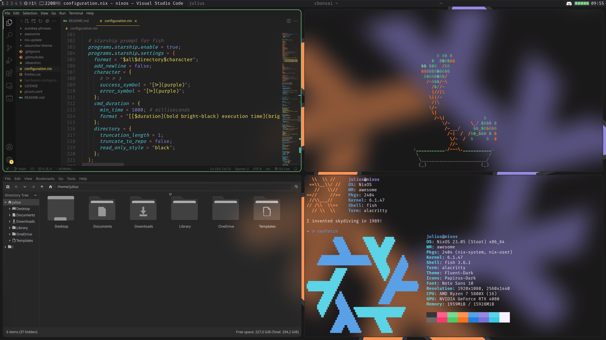
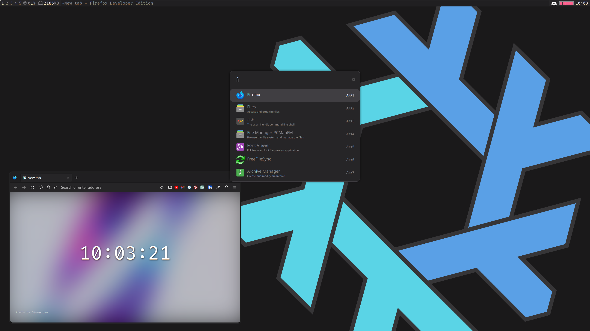

# [NixOS](https://nixos.org/) configuration and other dotfiles
> These dotfiles are what I daily drive at home, so you can be sure that they (kind of) work

### Credit
- My [awesome](https://awesomewm.org/) config is based on the "rainbow" theme of [awesome-copycats](https://github.com/lcpz/awesome-copycats), which I then modified to fit my taste and needs
- My wallpaper is a modified version of `nix-wallpaper-nineish-dark-gray` of [nixos-artwork](https://github.com/NixOS/nixos-artwork)

# Screenshots
<p align="middle">
  
   
</p>

# Content overview
> Note: "Recommended directory" is the path to the directory where the described file (or directory) is usually located. Also see the commands to create corresponding symbolic links under [Installation & usage](#installation--usage).

| File or directory | Recommended directory | Description |
|-------------------|-----------------------|-------------|
| `configuration.nix` | `/etc/nixos/` | [NixOS](https://nixos.org) configuration |
| `nix-update/` | `/etc/nixos/` | Scripts to automatically update and clean up [NixOS](https://nixos.org) after a prompt every saturday |
| `awesome/` | `~/.config/` | Configuration for [Awesome](https://github.com/awesomeWM/awesome) including a theme based on [awesome-copycats](https://github.com/lcpz/awesome-copycats)' "rainbow" theme |
| `picom.conf` | `~/.config/` | Configuration for [picom (`jonaburg`-fork)](https://github.com/jonaburg/picom) |
| `firefox.css` | `~/.mozilla/firefox/[YOUR-PROFILE]/chrome/` | `userChrome.css` for theming [Firefox](https://www.mozilla.org/en-US/firefox/new/) |
| `ulauncher-theme/` | `~/.config/ulauncher/user-themes/` | Custom color theme for [Ulauncher](https://github.com/Ulauncher/Ulauncher/) |
| `.ideavimrc` | `~/` | Like `.vimrc`, but for [IntelliJ IDEA](https://github.com/JetBrains/intellij-community) using [IdeaVim](https://github.com/JetBrains/ideavim) |
| `autokey-phrases/` | `~/.config/autokey/` | Phrases for [AutoKey](https://github.com/autokey/autokey) to make `Ctrl+Alt` act like `AltGr` for some keys like they do on Windows with a German keyboard layout |

# Installation & usage

- Most of these dotfiles can be used independently of the others, like `picom.conf` for configuring [picom](https://github.com/jonaburg/picom). You are free to use just parts the parts you like as they suit you.
    - See [Content overview](#content-overview) for explanations of files and directories.
- The following guide explains installation on a [NixOS](https://nixos.org/) system (which is my use case).
- 🚨 This guide assumes that you have either backed up your config files or don't care about them, as it may override or delete them.
- 🚨 There is some stuff in here that is not prepared to be used by anyone else besides me, so you are **strongly advised** to look through these files on your own before using them.

Add channels for a stable NixOS release and [home-manager](https://github.com/nix-community/home-manager) (versions like `23.05` might need adjustment):
```shell
# check subscribed channels
sudo nix-channel --list # should show that no channels are subscribed (otherwise you should remove them)
# add channels
sudo nix-channel --add https://nixos.org/channels/nixos-23.05 nixos
sudo nix-channel --add https://github.com/nix-community/home-manager/archive/release-23.05.tar.gz home-manager
# update
sudo nix-channel --update
sudo nixos-rebuild switch
```
Place the content of this repository inside `/etc/nixos`. A rough way to do this (assuming you have the necessary permissions) is:
```shell
cd /tmp
git clone --recurse-submodules https://github.com/julius-boettger/dotfiles.git
cp -r dotfiles/* /etc/nixos
```
Make sure to carefully inspect `configuration.nix` and edit it as needed before rebuilding, as you may not want e.g. NVIDIA drivers or the username `julius`. Then rebuild your system (e.g. `sudo nixos-rebuild switch`).

Now create symbolic links to put the dotfiles in the right locations:
```shell
ln -s /etc/nixos/.ideavimrc ~
ln -s /etc/nixos/awesome ~/.config
ln -s /etc/nixos/picom.conf ~/.config
ln -s /etc/nixos/autokey-phrases ~/.config/autokey/phrases
# ulauncher theme
mkdir -p ~/.config/ulauncher/user-themes
ln -s /etc/nixos/ulauncher-theme ~/.config/ulauncher/user-themes/mytheme
# firefox theme (adjust paths to point to your profile!)
mkdir -p ~/.mozilla/firefox/[YOUR-PROFILE]/chrome
ln -s /etc/nixos/firefox.css ~/.mozilla/firefox/[YOUR-PROFILE]/chrome/userChrome.css
```

Also make sure to set `toolkit.legacyUserProfileCustomizations.stylesheets = true` on `about:config` to apply the Firefox theme (more info [here](https://www.userchrome.org/how-create-userchrome-css.html#aboutconfig)).

If you want to use [circadian](https://github.com/mrmekon/circadian), I found it easiest to manually build it and place the executable under `~/.local/bin`. My `configuration.nix` should take care of the rest (writing a config file and setting up a systemd-service).

Finally some Ulauncher customization: Open Ulauncher with `Super+R` and click on the little gear to access the settings.
- Preferences
    - Click on "Hotkey" and press `ESC` to delete the hotkey, Awesome manages that
    - Click on "Color Theme" and select "My Theme"
    - Turn off "Show Indicator Icon"
- Extensions: Install the following extensions by clicking on "Add extension" and entering a Github-link
```
https://github.com/Ulauncher/ulauncher-emoji
https://github.com/iboyperson/ulauncher-system
https://github.com/ulauncher-extensions/ulauncher-conversion
```
